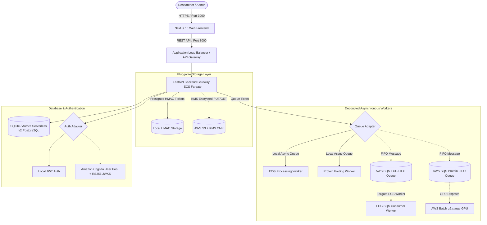

# BioCloud Workbench: Cloud-Native ECG Analysis & Protein Structure Prediction

BioCloud Workbench is an enterprise research workbench delivering dual computational pipelines within a unified, cloud-native microservices architecture:

1. **Health Care — ECG Analysis in the Cloud**: Multi-lead and single-lead ECG signal ingestion, 4th-order zero-phase 0.5–40 Hz Butterworth bandpass filtering, Pan-Tompkins R-peak detection, comprehensive autonomic time-domain HRV metrics (mean HR, min/max HR, SDNN, RMSSD, pNN50, SNR), Welch periodogram frequency-domain HRV (VLF, LF, HF, Total Power, LF/HF balance ratio, LFnu/HFnu), versioned arrhythmia screening rule plugins, and a high-performance interactive 12-lead medical grid waveform visualizer.
2. **Biology — Protein Structure Prediction**: Standardized FASTA sequence ingestion, strict IUPAC amino acid verification, live UniProt/PDB biological metadata lookup, molecular weight & residue property analytics, ESMFold v1 GPU execution adapter with structured degradation to `model_unavailable` (anti-hallucination policy), verified structural benchmarks (Trp-cage fold `1L2Y`, Insulin B-chain, Crambin), and interactive 3D ribbon molecular visualizer with per-residue pLDDT confidence color coding.

---

## Documentation Quick Links

- [Backend Architecture & API Documentation](file:///c:/Users/rajub/Documents/Codex/2026-09-28/onc/outputs/biocloud-workbench/backend/README.md)
- [Frontend Web App Architecture & UI Guide](file:///c:/Users/rajub/Documents/Codex/2026-09-28/onc/outputs/biocloud-workbench/frontend/README.md)
- [AWS Cloud Infrastructure Guide (Terraform)](file:///c:/Users/rajub/Documents/Codex/2026-09-28/onc/outputs/biocloud-workbench/infra/README.md)
- [Developer Automation & Scripts Guide](file:///c:/Users/rajub/Documents/Codex/2026-09-28/onc/outputs/biocloud-workbench/scripts/README.md)
- [Project Handover Dossier & Audit Review](file:///C:/Users/rajub/.gemini/antigravity-ide/brain/3cdd2a0c-6aef-41b3-8b96-203bf3e87307/project_handover_dossier.md)
- [Application Output Showcase (Screenshots & Recordings)](file:///C:/Users/rajub/.gemini/antigravity-ide/brain/3cdd2a0c-6aef-41b3-8b96-203bf3e87307/application_output_showcase.md)
- [ECG Signal Processing Verification Report](file:///C:/Users/rajub/.gemini/antigravity-ide/brain/3cdd2a0c-6aef-41b3-8b96-203bf3e87307/ecg_verification_report.md)
- [Protein Structure Prediction Verification Report](file:///C:/Users/rajub/.gemini/antigravity-ide/brain/3cdd2a0c-6aef-41b3-8b96-203bf3e87307/protein_verification_report.md)
- [Performance & Load Benchmark Report](file:///C:/Users/rajub/.gemini/antigravity-ide/brain/3cdd2a0c-6aef-41b3-8b96-203bf3e87307/benchmark_performance_report.md)
- [Terraform Infrastructure Review & Security Audit](file:///C:/Users/rajub/.gemini/antigravity-ide/brain/3cdd2a0c-6aef-41b3-8b96-203bf3e87307/terraform_architecture_review.md)

---

## Architecture Overview



---

## Key Features

- **Unified Research Workspace**: Seamlessly toggle between ECG Analysis and Protein Prediction while preserving active study project context.
- **Role-Based Access Control**:
  - **Researcher**: Upload files, run signal processing, submit folding jobs, inspect waveforms and 3D ribbon structures, export results.
  - **Administrator**: Manage system users, activate/deactivate pipeline model versions, inspect tamper-resistant security audit logs.
- **Genuine Signal Processing & Autonomic Metrics**:
  - Real Butterworth 4th-order bandpass filter (0.5–40 Hz), Pan-Tompkins moving integration window, dynamic thresholding, SNR estimation.
  - **Time-Domain HRV**: Mean HR, min/max HR, mean RR, SDNN, RMSSD, pNN50.
  - **Frequency-Domain HRV (Welch Periodogram)**: VLF power (0.003–0.04 Hz), LF power (0.04–0.15 Hz), HF power (0.15–0.40 Hz), Total power, LF/HF autonomic sympathetic-vagal balance ratio, and normalized units (LFnu / HFnu).
- **Direct UniProt & PDB Sequence Lookup**:
  - Instant biological retrieval by UniProt accession (e.g., `P01308`, `P04637`, `P68871`, `P01116`), gene symbol (`INS`, `TP53`, `HBB`, `KRAS`), or PDB ID (`1CRN`, `1UBQ`).
  - Automatic IUPAC residue validation, molecular weight computation, function annotations, and AlphaFold DB links.
- **Strict Scientific & Regulatory Integrity**: No fake or simulated PDB atomic coordinates. When GPU weights are unconfigured, actionable instructions are provided alongside verified benchmark reference structures (`1L2Y` Trp-cage fold) for synthetic testing.
- **Interactive Visualizations**:
  - **12-Lead Multi-Lead ECG Viewer**:
    - **12-Lead Clinical Grid**: Standard 3x4 clinical layout (`[I, aVR, V1, V4]`, `[II, aVL, V2, V5]`, `[III, aVF, V3, V6]`) with continuous 10-second Lead II rhythm strip.
    - **Single-Lead Focused View**: Medical-standard SVG grid (1 mm / 5 mm), 1.0 mV square calibration pulse, Pan-Tompkins peak markers, drag-to-pan, scroll-to-zoom, and millivolt/millisecond crosshair tooltips.
    - **Lead Selector Pills**: Direct toggling between Limb (`I, II, III`), Augmented (`aVR, aVL, aVF`), and Precordial (`V1-V6`) channels.
    - **Aesthetic Switching**: Toggle between classic Pink Clinical ECG Paper and Dark Modern Monitor modes.
  - **Molecular Viewer**: WebGL-style 3D depth-sorted ribbon visualizer with mouse rotation, auto-spin, zoom, and per-residue pLDDT confidence spectrum (Very High >90, Confident 70-90, Low 50-70, Very Low <50).

---

## Seed Accounts (Local Development)

| Role | Email | Password | Permissions |
| :--- | :--- | :--- | :--- |
| **Researcher** | `researcher@biocloud.local` | `Researcher123!` | Standard project creation, file upload, job dispatch |
| **Administrator** | `admin@biocloud.local` | `AdminSecure2026!` | System settings, user management, model toggles, audit logs |

*Note: Quick-login chips are available directly inside the application sign-in modal.*

---

## Quickstart: Local Development

### Prerequisites
- Python 3.11+
- Node.js 18+ (Node.js 20+ recommended)
- Git

### 1. Start the Backend API

```powershell
# In project root
python -m venv .venv
.\.venv\Scripts\Activate.ps1    # On Linux/macOS: source .venv/bin/activate

# Install dependencies
pip install -r backend/requirements.txt

# Run database setup & start server on port 8000
python -m uvicorn backend.app.main:app --host 127.0.0.1 --port 8000 --reload
```

The backend automatically creates and seeds `./data/biocloud.db` with the default researcher and administrator accounts, plus a default study project.

- Swagger / OpenAPI Docs: `http://127.0.0.1:8000/docs`
- Health Check: `http://127.0.0.1:8000/api/v1/health`

### 2. Start the Frontend Web Application

```powershell
# In a separate terminal
cd frontend
npm install
npm run dev
```

Open `http://localhost:3000` in your web browser.

---

## Multi-Tier Automated Smoke Testing

BioCloud Workbench includes an automated, end-to-end smoke test script validating all tiers of the platform:

```powershell
python scripts/smoke_test.py
```

### Smoke Test Checkpoints:
1. **Configuration & Mode Check**: Inspects `.env` settings (`LOCAL_DEV_MODE`, `STORAGE_TYPE`, `QUEUE_TYPE`, `DATABASE_URL`).
2. **Database Integrity & Schema**: Verifies SQLite database file existence (`data/biocloud.db`), runs `PRAGMA integrity_check`, and confirms all 8 core tables exist.
3. **Backend REST API Health**: Queries `/api/v1/health` to confirm `status == "healthy"` and database connectivity.
4. **Project Access & Multi-Tenancy**: Fetches study projects via `/api/v1/projects` with Bearer auth.
5. **ECG Pipeline End-to-End**: Generates synthetic 12-lead ECG, runs 0.5–40 Hz bandpass filtering, detects Pan-Tompkins R-peaks, and calculates SDNN, RMSSD, and Welch LF/HF autonomic ratios.
6. **Protein Pipeline End-to-End**: Validates FASTA sequences against IUPAC rules and executes structure prediction on verified Trp-cage `1L2Y` benchmark.
7. **Compute Job State Lifecycle**: Dispatches background job and verifies status transitions (`QUEUED` ➔ `PROCESSING` ➔ `COMPLETED`).
8. **Storage Adapter Operation**: Tests HMAC presigned ticket generation and file storage upload/download.
9. **Frontend Web App Reachability**: Verifies HTTP 200 response on `http://localhost:3000`.

---

## Running the Automated Test Suite

Run the full automated test suite covering authentication, project security, ECG DSP algorithms, FASTA validation, S3 KMS URLs, Cognito RS256 token verification, separate SQS FIFO queue routing, consumer idempotency and failure handling, and AWS Batch job submission:

```powershell
python -m pytest backend/tests/ -v
```

All 49 unit and integration tests execute against isolated test adapters and mocks with zero external cloud dependencies or charges.

---

## Database Migrations (Alembic)

BioCloud Workbench manages relational schemas via versioned Alembic migrations:

```bash
# Apply migrations to configured database (SQLite in dev, Aurora PostgreSQL in prod)
alembic upgrade head

# Create a new migration revision
alembic revision --autogenerate -m "describe_schema_change"
```

In production AWS mode (`LOCAL_DEV_MODE=false`), the application tests connectivity via `SELECT 1` at startup and strictly enforces that database migrations have been executed.

---

## Offline AWS Cloud Emulation (Moto Server)

To test AWS cloud adapters without incurring cloud charges, use the included local AWS emulator script:

```powershell
# 1. Start Moto emulator daemon on port 5000 (in separate terminal)
python -m moto.server -H 127.0.0.1 -p 5000

# 2. Provision emulated S3 bucket, KMS key, SQS FIFO queues, and Cognito user pool
python scripts/init_local_aws.py

# 3. Test with explicit database connectivity check
python scripts/init_local_aws.py --db-url "sqlite:///data/biocloud.db"

# 4. Revert back to local development mode when done
python scripts/init_local_aws.py --local
```

---

## CI/CD Pipeline (GitHub Actions)

Continuous Integration is automated via [ci.yml](file:///c:/Users/rajub/Documents/Codex/2026-09-28/onc/outputs/biocloud-workbench/.github/workflows/ci.yml) on all pull requests and pushes to `main`:

1. **Backend Test Suite**: Python 3.11 environment, SQLite database setup, Alembic migration run, and `pytest backend/tests/ -v`.
2. **Frontend Production Build**: Node.js 20 environment, dependency installation, TypeScript compilation, and `npm run build`.
3. **Terraform Validation**: Terraform CLI initialization, format check (`terraform fmt -check`), and configuration validation (`terraform validate`).

---

## Configuration Reference

The application uses consistent environment variable names across `backend/app/config.py`, `.env.example`, `docker-compose.yml`, and `infra/terraform/`:

| Setting | Type / Allowed Values | Default | Description |
| :--- | :--- | :--- | :--- |
| `DATABASE_URL` | Connection String | `sqlite:///data/biocloud.db` | PostgreSQL/Aurora or SQLite database URL (PostgreSQL required in AWS mode) |
| `LOCAL_DEV_MODE` | Boolean (`true`/`false`) | `true` | When `true`, enables local disk, local queue, and mock auth. When `false`, enforces strict AWS configuration |
| `STORAGE_TYPE` | `local` \| `s3` | `local` | Storage adapter backend |
| `AWS_S3_BUCKET` | String | *Empty* | Private S3 bucket name for ECG datasets and predicted PDB structures |
| `AWS_REGION` | String | `us-east-1` | AWS deployment region |
| `AWS_KMS_KEY_ID` | String / ARN | *Empty* | Customer-managed KMS key ID for SSE-KMS object and database encryption |
| `QUEUE_TYPE` | `local` \| `sqs` | `local` | Asynchronous queue adapter |
| `SQS_ECG_QUEUE_URL` | URL | *Empty* | SQS FIFO queue URL for ECG signal processing jobs |
| `SQS_PROTEIN_QUEUE_URL` | URL | *Empty* | SQS FIFO queue URL for protein structure prediction jobs (must be separate from ECG) |
| `COGNITO_USER_POOL_ID` | String | *Empty* | Amazon Cognito User Pool identifier |
| `COGNITO_CLIENT_ID` | String | *Empty* | Amazon Cognito App Client ID |
| `COGNITO_REGION` | String | `us-east-1` | Cognito User Pool AWS region |
| `BATCH_PROTEIN_ENABLED` | Boolean (`true`/`false`) | `false` | Enables AWS Batch GPU dispatch for protein structure prediction |
| `BATCH_PROTEIN_JOB_QUEUE` | String | *Empty* | AWS Batch GPU compute queue name for ESMFold predictions |
| `BATCH_PROTEIN_JOB_DEFINITION` | String / ARN | *Empty* | AWS Batch Job Definition name or ARN |
| `ESMFOLD_MODEL_ENABLED` | Boolean (`true`/`false`) | `false` | Enables real ESMFold inference (requires PyTorch GPU or Batch cluster) |
| `ESMFOLD_DEVICE` | String | `cuda:0` | GPU compute device |

---

## Containerized Deployment with Docker Compose

Run the entire multi-container stack locally with a single command:

```bash
docker-compose up --build
```

Services started:
- `backend`: FastAPI API service (`http://localhost:8000`)
- `worker-ecg`: Dedicated ECG signal processing worker container
- `worker-protein`: Dedicated protein structure prediction worker container
- `frontend`: Production Next.js server (`http://localhost:3000`)

---

## AWS Production Infrastructure (Terraform)

All AWS cloud infrastructure is declaratively defined in `infra/terraform/`:

- **Networking**: VPC with public subnets, private application subnets, and private database subnets across 2 Availability Zones, with Internet Gateway and NAT Gateways.
- **Application Load Balancer**: Multi-AZ Application Load Balancer (`aws_lb.api`) routing HTTP/HTTPS traffic to backend target groups.
- **ECS Fargate Services**:
  - `aws_ecs_service.backend`: Containerized FastAPI REST API gateway running in private subnets behind the ALB.
  - `aws_ecs_service.ecg_worker`: Dedicated SQS FIFO consumer worker container for asynchronous ECG processing.
- **S3 Bucket**: Private bucket with Public Access Block, bucket versioning, SSE-KMS default encryption, and noncurrent version lifecycle expiration.
- **KMS Customer Managed Key**: Unified CMK with key rotation enabled for S3, Aurora, Secrets Manager, and CloudWatch Logs.
- **Amazon Aurora Serverless v2 PostgreSQL**: Provisioned inside private database subnets with automated backups, Secrets Manager credential generation, and connection pooling.
- **Amazon SQS FIFO Queues**: Dedicated `biocloud-ecg-queue.fifo` and `biocloud-protein-queue.fifo` with associated Dead-Letter Queues (DLQ) and CloudWatch message threshold alarms.
- **Amazon Cognito User Pool**: Pre-configured `Researchers` and `Administrators` user groups, password policy, and Web App Client.
- **AWS Batch GPU Compute**: Managed compute environment with EC2 `g5.xlarge` GPU instances, Job Queue, and container Job Definition.

### Safe Validation Commands (No Cloud Charges)

> [!IMPORTANT]
> **NO AWS RESOURCES HAVE BEEN DEPLOYED**:
> Running the following commands performs formatting, linting, syntax validation, and dry-run execution planning. **Do not run `terraform apply`** unless you intend to provision real cloud resources and incur AWS billing.

```bash
cd infra/terraform

# 1. Format configuration
terraform fmt -check

# 2. Initialize provider plugins
terraform init

# 3. Validate syntax and configuration integrity (returns Success!)
terraform validate

# 4. Review dry-run execution plan (safe; does not provision resources)
terraform plan
```

### Cost-Bearing AWS Resources (Review Before Deployment)

When deployed, the following cloud resources incur billing on your AWS account:
1. **Amazon Aurora Serverless v2**: Billed per ACU-hour consumed (configured minimum 0.5 ACU, auto-scaling up to 4.0 ACU).
2. **VPC NAT Gateway**: Billed hourly per active NAT gateway (~$0.045/hr) plus per-GB data processing fees.
3. **Application Load Balancer**: Billed hourly (~$0.0225/hr) plus Load Balancer Capacity Units (LCUs).
4. **AWS Batch EC2 GPU Instances**: Billed per second for EC2 `g5.xlarge` instances when protein prediction jobs run (configured to scale to 0 vCPUs when idle).
5. **AWS KMS Customer Managed Key**: $1.00/month per active key plus API request fees.

---

## Regulatory and Scientific Disclaimers

> [!WARNING]
> **RESEARCH USE ONLY (RUO)**:
> BioCloud Workbench is designed strictly as an investigative research tool and software demonstration platform. It has **NOT** been evaluated, cleared, or approved by the United States Food and Drug Administration (FDA), European Medicines Agency (EMA), or any other medical regulatory authority.
> 
> It is **NOT intended for use in the diagnosis, cure, mitigation, treatment, or prevention of disease** in humans or animals. Under no circumstances should algorithmic rhythm classifications or predicted protein coordinates be utilized as the basis for direct clinical decisions, patient triage, or prescribing therapy without independent physical validation.
