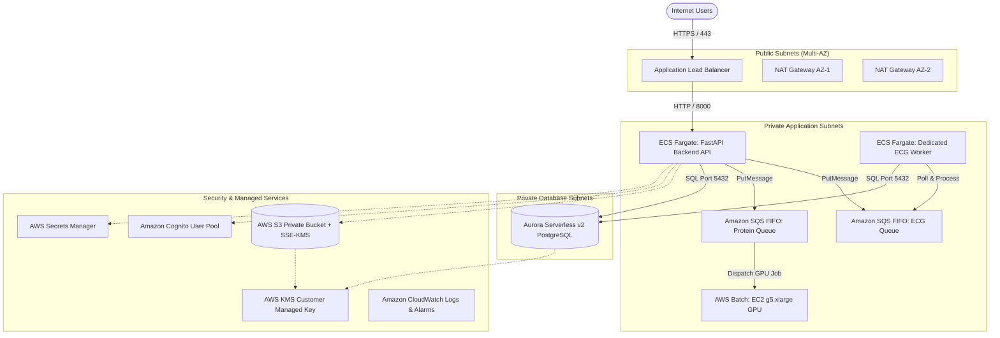

# BioCloud Workbench: AWS Cloud Infrastructure (Terraform)

This directory contains the declarative Infrastructure-as-Code (IaC) configuration for deploying **BioCloud Workbench** on Amazon Web Services (AWS) using **Terraform**.

---

## Cloud Architecture Diagram



---

## Infrastructure Resources

### 1. Networking & Segmentation (`main.tf`)
- **Virtual Private Cloud (VPC)**: Isolated CIDR block (`10.0.0.0/16`) spanned across 2 Availability Zones (`us-east-1a`, `us-east-1b`).
- **Subnet Tiers**:
  - **Public Subnets** (`10.0.1.0/24`, `10.0.2.0/24`): Host the Application Load Balancer and NAT Gateways.
  - **Private Application Subnets** (`10.0.11.0/24`, `10.0.12.0/24`): Host ECS Fargate API tasks and worker containers. Route outbound traffic via NAT Gateways.
  - **Private Database Subnets** (`10.0.21.0/24`, `10.0.22.0/24`): Host Amazon Aurora Serverless v2 PostgreSQL instances. Strictly isolated with no direct route to the Internet.

### 2. Traffic Ingress & Routing
- **Application Load Balancer (`aws_lb.api`)**: Multi-AZ public load balancer distributing incoming API traffic.
- **Target Groups & Health Probes**: Routes traffic to backend tasks on port 8000 with automated health checking on `/api/v1/health` (healthy threshold: 2 consecutive checks, interval: 30 seconds).

### 3. Containerized Compute (ECS Fargate)
- **ECS Cluster**: Dedicated cluster `biocloud-cluster` with Fargate and Fargate Spot capacity providers.
- **FastAPI Backend Service (`aws_ecs_service.backend`)**: Containerized API gateway running behind the ALB with automated rollback and least-privilege IAM task roles.
- **ECG Worker Service (`aws_ecs_service.ecg_worker`)**: Dedicated background consumer task reading from the ECG SQS FIFO queue with exponential backoff.

### 4. GPU Compute for Biology (AWS Batch)
- **AWS Batch Compute Environment**: Configured with EC2 `g5.xlarge` GPU instances (1x NVIDIA A10G 24GB VRAM).
- **Scale-to-Zero Policy**: `min_vcpus = 0` ensures that GPU instances terminate automatically when the protein prediction queue is empty, avoiding unnecessary idle cloud expenditure.
- **Job Definition**: Pre-configured with container image `biocloud-protein-worker:latest`, CUDA drivers, and IAM access to S3 and SQS.

### 5. Managed Relational Database (Amazon Aurora)
- **Aurora Serverless v2 PostgreSQL**: Auto-scaling database compute from **0.5 ACU** (idle / low load) up to **4.0 ACU** (peak throughput).
- **Security & Storage**: Fully encrypted at rest using Customer Managed Key (`aws:kms`). Master credentials automatically generated and rotated in **AWS Secrets Manager**.

### 6. Message Queues (Amazon SQS FIFO)
- **Separate FIFO Queues**:
  - `biocloud-ecg-queue.fifo`: Dedicated to high-throughput ECG digital signal processing.
  - `biocloud-protein-queue.fifo`: Dedicated to GPU-intensive protein structure predictions.
- **Reliability & Idempotency**: Content-Based Deduplication enabled, 300-second message visibility timeout, and dedicated Dead-Letter Queues (DLQs) with max receive count of 3.

### 7. Object Storage & Key Management
- **Amazon S3**: Private bucket with versioning, 4-tier Public Access Block (`BlockPublicAcls`, `IgnorePublicAcls`, `BlockPublicPolicy`, `RestrictPublicBuckets`), and SSE-KMS default encryption.
- **AWS KMS Customer Managed Key**: Single centralized CMK with yearly key rotation enabled, utilized across S3, Aurora, Secrets Manager, and CloudWatch.

### 8. Identity & Access Management
- **Amazon Cognito User Pool**: Email-based authentication with pre-configured `Researchers` and `Administrators` user groups and OAuth 2.0 Web Client (`ALLOW_USER_PASSWORD_AUTH`).

---

## Terraform Variables Reference

| Variable Name | Type | Default | Description |
| :--- | :--- | :--- | :--- |
| `aws_region` | string | `us-east-1` | Target AWS deployment region |
| `environment` | string | `production` | Deployment stage tag (`dev`, `staging`, `production`) |
| `project_name` | string | `biocloud` | Resource name prefix for all provisioned AWS services |
| `vpc_cidr` | string | `10.0.0.0/16` | Primary IPv4 CIDR block for the VPC |
| `aurora_min_acu` | number | `0.5` | Minimum Aurora Serverless v2 capacity units (0.5 ACU = 1GB RAM) |
| `aurora_max_acu` | number | `4.0` | Maximum Aurora Serverless v2 capacity units |
| `gpu_instance_type` | string | `g5.xlarge` | EC2 GPU instance type for AWS Batch ESMFold predictions |

---

## Safe Validation Commands (Zero AWS Billing)

> [!IMPORTANT]
> **DO NOT RUN `terraform apply`** unless you are authorized to provision real cloud infrastructure and incur billing on your AWS account.
> The commands below perform syntax formatting, provider initialization, and dry-run execution planning with zero charges:

```bash
cd infra/terraform

# 1. Format check
terraform fmt -check

# 2. Initialize provider plugins (AWS Provider v5+)
terraform init

# 3. Validate configuration syntax and schema integrity
terraform validate

# 4. Review dry-run execution plan (safe; does not provision resources)
terraform plan -out=tfplan.binary
```

---

## Cost-Bearing Resource Breakdown

When provisioned via `terraform apply`, the following services will generate charges on your AWS invoice:

| Resource | Billing Basis | Estimated Monthly Cost | Optimization Strategy |
| :--- | :--- | :--- | :--- |
| **Amazon Aurora Serverless v2** | ACU-hour ($0.12/ACU-hr) | ~$43.20/mo (at 0.5 ACU min) | Scale down when inactive or use SQLite for development |
| **VPC NAT Gateways (2 AZs)** | Hourly ($0.045/hr) + Data ($0.045/GB) | ~$65.00/mo | Use 1 NAT Gateway for staging, or VPC endpoints for S3/SQS |
| **Application Load Balancer** | Hourly ($0.0225/hr) + LCU | ~$16.50/mo | Direct ingress during low traffic |
| **AWS Batch EC2 GPU (`g5.xlarge`)** | Per-second ($1.006/hr on-demand) | $0.00 when idle | `min_vcpus = 0` automatically terminates instances when queue is empty |
| **AWS KMS Customer Managed Key** | Flat per-key ($1.00/mo) | $1.00/mo | Shared across all storage and database services |
| **Amazon S3 & SQS FIFO** | Storage GB & Request volume | Pay-per-use (fraction of a dollar) | Negligible for benchmark datasets |

---

## 1-Click AWS Console Deployment (CloudFormation)

If you prefer to deploy directly from the AWS Web Console without installing or configuring CLI access keys:

Use the pre-built template: [`infra/cloudformation/biocloud-stack.yaml`](file:///c:/Users/rajub/Documents/Codex/2026-09-28/onc/outputs/biocloud-workbench/infra/cloudformation/biocloud-stack.yaml).

1. Open **[AWS CloudFormation Console (eu-north-1)](https://eu-north-1.console.aws.amazon.com/cloudformation/home?region=eu-north-1#/stacks/create/template)**.
2. Select **Template is ready** ➔ **Upload a template file**.
3. Choose `infra/cloudformation/biocloud-stack.yaml`.
4. Name the stack `biocloud-workbench` and click **Submit**.
5. CloudFormation automatically provisions the S3 bucket, SQS FIFO queues, Cognito user pools, ECR repositories, and ECS cluster in Stockholm (`eu-north-1`).

---

## Teardown & Clean-up

To safely destroy all provisioned cloud resources and stop all AWS billing:

```bash
cd infra/terraform
terraform destroy
```

Verify that all S3 buckets are emptied of predicted PDB structures and raw ECG files before executing `terraform destroy`.
